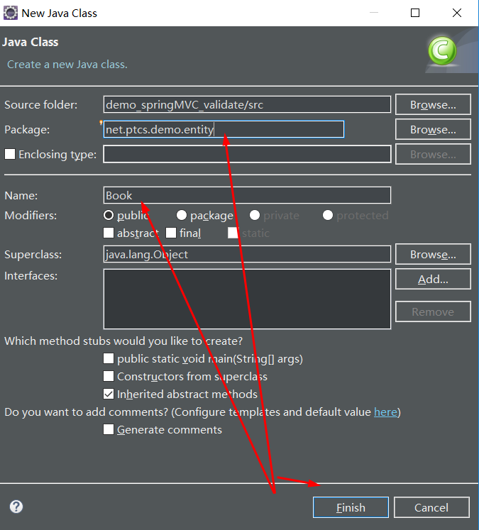

# 64-Java-springMVC服务端数据校验如何实现?

1. 新建一个动态web工程 命名 **demo_springMVC_validate**


2. 导入对应的jar包并添加到内路径


3. 导入对应的配置文件


**springmvc-servlet.xml**

```
<?xml version="1.0" encoding="UTF-8"?>

<beans xmlns="http://www.springframework.org/schema/beans"
	xmlns:xsi="http://www.w3.org/2001/XMLSchema-instance" xmlns:context="http://www.springframework.org/schema/context"
	xmlns:mvc="http://www.springframework.org/schema/mvc" xmlns:aop="http://www.springframework.org/schema/aop"
	xsi:schemaLocation="http://www.springframework.org/schema/beans
           http://www.springframework.org/schema/beans/spring-beans-2.5.xsd
           http://www.springframework.org/schema/mvc http://www.springframework.org/schema/mvc/spring-mvc.xsd
           http://www.springframework.org/schema/context http://www.springframework.org/schema/context/spring-context-2.5.xsd
           http://www.springframework.org/schema/aop http://www.springframework.org/schema/aop/spring-aop-2.5.xsd">

	<bean
		class="org.springframework.web.servlet.view.InternalResourceViewResolver">
		<property name="prefix" value="/"></property>
		<property name="suffix" value=".jsp"></property>  <!-- /WEB-INF/index.jsp -->
	</bean>

	<mvc:annotation-driven conversion-service="conversionService" validator="validator"></mvc:annotation-driven>

	<!-- 定义校验器bean -->
	<bean id="validator"
		class="org.springframework.validation.beanvalidation.LocalValidatorFactoryBean">
		<property name="providerClass" value="org.hibernate.validator.HibernateValidator"></property>
		<property name="validationMessageSource" ref="messageSource"></property>
	</bean>

<!-- 定义校验出错的信息提示文件 -->
	<bean id="messageSource"
		class="org.springframework.context.support.ReloadableResourceBundleMessageSource">
		<property name="basenames">
			<list>
				<value>classpath:customerValidationMessages</value>
			</list>
		</property>
		<property name="fileEncodings" value="utf-8"></property>
	</bean>


	<bean id="conversionService"
		class="org.springframework.format.support.FormattingConversionServiceFactoryBean">
		<property name="converters">
			<list>
				<bean class="net.neuedu.demo.converter.CustomerDateConverter"></bean>
			</list>
		</property>

	</bean>

	<context:component-scan base-package="net.neuedu.demo.controller"></context:component-scan>
</beans>
```

**web.xml**

```
<?xml version="1.0" encoding="UTF-8"?>
<web-app xmlns:xsi="http://www.w3.org/2001/XMLSchema-instance" xmlns="http://xmlns.jcp.org/xml/ns/javaee" xsi:schemaLocation="http://xmlns.jcp.org/xml/ns/javaee http://xmlns.jcp.org/xml/ns/javaee/web-app_3_1.xsd" version="3.1">
  <display-name>demo_springMVC_helloworld</display-name>
  <servlet>
    <servlet-name>springmvc</servlet-name>
    <servlet-class>org.springframework.web.servlet.DispatcherServlet</servlet-class>
  </servlet>
  <servlet-mapping>
    <servlet-name>springmvc</servlet-name>
    <url-pattern>*.do</url-pattern>
  </servlet-mapping>
  <welcome-file-list>
    <welcome-file>index.html</welcome-file>
    <welcome-file>index.htm</welcome-file>
    <welcome-file>index.jsp</welcome-file>
    <welcome-file>default.html</welcome-file>
    <welcome-file>default.htm</welcome-file>
    <welcome-file>default.jsp</welcome-file>
  </welcome-file-list>
</web-app>
```

4. 新建包 **net.ptcs.demo.controller**


5. 新建Jsp页面 **add_book.jsp**


```
<%@ page language="java" contentType="text/html; charset=UTF-8"
	pageEncoding="UTF-8"%>
<%@taglib prefix="c" uri="http://java.sun.com/jsp/jstl/core"%>
<!DOCTYPE html>
<html>
<head>
<meta http-equiv="Content-Type" content="text/html; charset=UTF-8">
<title>添加图书页面</title>
</head>
<body>
	<form action="<%=request.getContextPath()%>/book/addBook.do"
		method="post">

		<c:if test="${errors!=null}">
			<c:forEach items="${errors}" var="e">
				${e.defaultMessage}<br>
			</c:forEach>
		</c:if>


		bookId:<input type="text" name="bookId" /><br> bookName:<input
			type="text" name="bookName" /><br> intoStoreTime:<input
			type="text" name="intoStoreTime" /><br> publishName:<input
			type="text" name="publishName" /><br> price:<input type="text"
			name="price" /><br> <input type="submit" value="添加" />

	</form>
</body>
</html>
```
此时报错信息如下：


```
Multiple annotations found at this line:
	- The superclass "javax.servlet.http.HttpServlet" was not found on the Java 
	 Build Path
	- Line breakpoint:add_book.jsp [line: 1]
```
**解决方法：**
项目右键 ----> Configure Build Path -----> Java Build Path ---> Add Library ---> Server RunTime ----> Next ---> Apache Tomcat v8.0 ---> Finish ---> Apply ---> Apply and close 


最后成功解决咯报错，如图所示


6. 新建一个 **Book** 实体类



```
package net.ptcs.demo.entity;

import java.util.Date;

import javax.validation.constraints.DecimalMin;
import javax.validation.constraints.Digits;
import javax.validation.constraints.NotBlank;
import javax.validation.constraints.NotNull;
import javax.validation.constraints.Pattern;
import javax.validation.constraints.Size;

public class Book {
	/*bookId:非空校验，整数校验，大于0的校验
	 * bookName:非空校验，不能有非法字符（符合书名的正则表达式规范）
	 * intoStoreTime：非空校验
	 * publishName：非空校验，不能有非法字符（符合出版社名的正则表达式规范）
	 * price：非空校验，大于0，小数校验*/
	
	@NotNull(message="{book.bookId.isNull}")
	private Integer bookId;
	@NotBlank(message="{book.bookName.isNull}")
	@Size(min=3,max=40,message="{book.bookName.size}")
	private String bookName;
	@NotNull(message="{book.intoStoreTime.isNull}")
	private Date intoStoreTime;
	@NotBlank(message="{book.publishName.isNull}")
	private String publishName;
	
	
	@Pattern(regexp = "^1(3|4|5|7|8)\\d{9}$",message = "手机号码格式错误")
	@NotBlank(message = "手机号码不能为空")
	private String phone;
	
	
	@NotNull(message="{book.price.isNull}")//对于数字校验是否为空使用@NotNull,String类型使用@NotBlank list类型使用@NotEmpty
	@Digits(fraction = 2, integer = 100, message="{book.price.error}")//对于小数进行校验，限定整数数位integer和小数数位fraction
	@DecimalMin(value = "0", message="{book.price.value}")//对值进行校验，必须大于等于value的值
	private Double price;

	public Book() {
		super();
	}

	public String getPhone() {
		return phone;
	}

	public void setPhone(String phone) {
		this.phone = phone;
	}

	@Override
	public String toString() {
		return "Book [bookId=" + bookId + ", bookName=" + bookName
				+ ", intoStoreTime=" + intoStoreTime + ", publishName="
				+ publishName + ", price=" + price + "]";
	}

	public Book(Integer bookId, String bookName, Date intoStoreTime,
			String publishName, Double price) {
		super();
		this.bookId = bookId;
		this.bookName = bookName;
		this.intoStoreTime = intoStoreTime;
		this.publishName = publishName;
		this.price = price;
	}

	public Integer getBookId() {
		return bookId;
	}

	public void setBookId(Integer bookId) {
		this.bookId = bookId;
	}

	public String getBookName() {
		return bookName;
	}

	public void setBookName(String bookName) {
		this.bookName = bookName;
	}

	public Date getIntoStoreTime() {
		return intoStoreTime;
	}

	public void setIntoStoreTime(Date intoStoreTime) {
		this.intoStoreTime = intoStoreTime;
	}

	public String getPublishName() {
		return publishName;
	}

	public void setPublishName(String publishName) {
		this.publishName = publishName;
	}

	public Double getPrice() {
		return price;
	}

	public void setPrice(Double price) {
		this.price = price;
	}
}
```
7. 在 net.ptcs.demo.controller 内下新建 BookController类

```
package net.ptcs.demo.controller;

import java.util.List;

import org.springframework.stereotype.Controller;
import org.springframework.ui.Model;
import org.springframework.validation.BindingResult;
import org.springframework.validation.ObjectError;
import org.springframework.validation.annotation.Validated;
import org.springframework.web.bind.annotation.RequestMapping;

import net.ptcs.demo.entity.Book;

/**
 * 图书管理模块的控制器，也叫做处理器
* <p>Title: BookController</p>  
* <p>Description: </p>  
* @author xianxian 
* @date 2019年6月25日
*/

@Controller
@RequestMapping("book")
public class BookController {
	/**
	 * use:处理页面添加图书的请求
	 * 
	 * 今天我们的需求：
	 * 1.在处理添加图书请求前对book对象中的属性进行校验：
	 * bookId:非空校验，整数校验，大于0的校验
	 * bookName:非空校验，不能有非法字符（符合书名的正则表达式规范）
	 * intoStoreTime：非空校验
	 * publishName：非空校验，不能有非法字符（符合出版社名的正则表达式规范）
	 * price：非空校验，大于0，小数校验
	 * 
	 * 2.校验的时机：addBook方法调用之前校验，如果校验通过那么继续，没有通过那么返回页面，提示出错信息
	 * 
	 * @param book
	 * @return
	 */
	@RequestMapping("addBook.do")
	public String addBook(@Validated Book book,BindingResult bindingResult,Model model)
	{
		List<ObjectError> errors=bindingResult.getAllErrors();
		
		if(errors.size()>0)
		{
			//校验失败
//			把出错信息传给页面
			model.addAttribute("errors", errors);
			model.addAttribute("book", book);
			return "add_book";//   /+add_book+.jsp
		}else
		{
			//校验成功
			System.out.println("into addBook()方法。。。。。");
			System.out.println("book:"+book);
			return "";
		}
	}
}
```

8. **src** 目录下新建一个 **customerValidattionMessages.properties**

```
book.bookId.isNull=\u56FE\u4E66\u7F16\u53F7\u4E0D\u80FD\u4E3A\u7A7A
book.bookName.isNull=\u56FE\u4E66\u540D\u79F0\u4E0D\u80FD\u4E3A\u7A7A
book.intoStoreTime.isNull=\u5165\u5E93\u65F6\u95F4\u4E0D\u80FD\u4E3A\u7A7A
book.publishName.isNull=\u51FA\u7248\u793E\u540D\u79F0\u4E0D\u80FD\u4E3A\u7A7A
book.price.isNull=\u4EF7\u683C\u4E0D\u80FD\u4E3A\u7A7A
book.bookName.size=\u56FE\u4E66\u540D\u79F0\u957F\u5EA6\u6700\u5C0F\u662F3\uFF0C\u6700\u5927\u662F40
book.price.isNull=\u4E66\u7684\u4EF7\u683C\u4E0D\u80FD\u4E3A\u7A7A
book.price.error=\u4E66\u7684\u4EF7\u683C\u683C\u5F0F\u9519\u8BEF
book.price.value=\u4E66\u7684\u4EF7\u683C\u5FC5\u987B\u5927\u4E8E0
```
9. 新建 net.ptcs.demo.converter 包下的 CustomerDateConverter 类

```
package net.ptcs.demo.converter;

import java.text.ParseException;
import java.text.SimpleDateFormat;
import java.util.Date;

import org.springframework.core.convert.converter.Converter;

public class CustomerDateConverter implements Converter<String,Date> {
	@Override
	public Date convert(String source) {
		Date date=null;
		if(source!=null && !"".equals(source))
		{
			SimpleDateFormat sdf=new SimpleDateFormat("yyyy-MM-dd");
			try {
				date=sdf.parse(source);
			} catch (ParseException e) {
				e.printStackTrace();
			}
		}
		return date;
	}
}
```


**以就就是我关于 Java-springMVC服务端数据校验如何实现?  知识点的整理与总结的全部内容 [另附源码链接](https://github.com/javaobjects/demo_springMVC_validate)**

==================================================================
#### 分割线
==================================================================

**博主为咯学编程：父母不同意学编程，现已断绝关系;恋人不同意学编程，现已分手;亲戚不同意学编程，现已断绝来往;老板不同意学编程,现已失业三十年。。。。。。如果此博文有帮到你欢迎打赏，金额不限。。。**

 