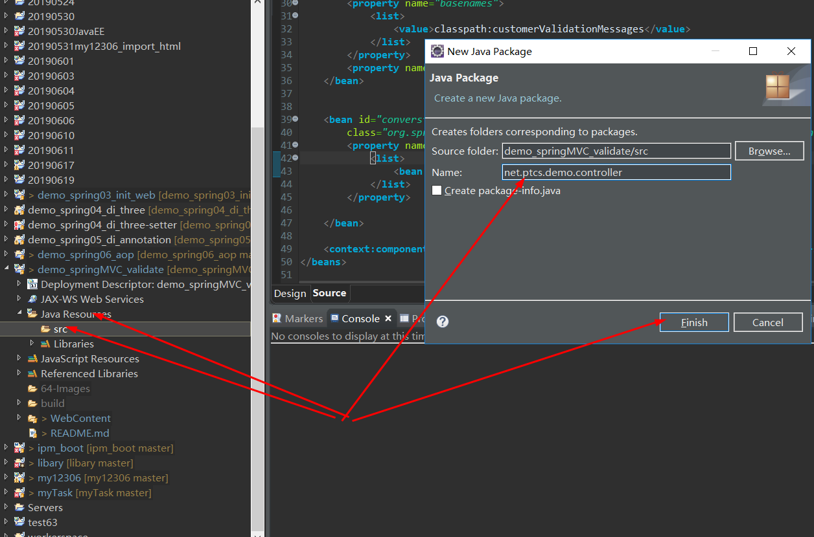

# 64-Java-springMVC服务端数据校验如何实现?

1. 新建一个动态web工程 命名 **demo_springMVC_validate**


2. 导入对应的jar包并添加到内路径


3. 导入对应的配置文件


**springmvc-servlet.xml**

```
<?xml version="1.0" encoding="UTF-8"?>

<beans xmlns="http://www.springframework.org/schema/beans"
	xmlns:xsi="http://www.w3.org/2001/XMLSchema-instance" xmlns:context="http://www.springframework.org/schema/context"
	xmlns:mvc="http://www.springframework.org/schema/mvc" xmlns:aop="http://www.springframework.org/schema/aop"
	xsi:schemaLocation="http://www.springframework.org/schema/beans
           http://www.springframework.org/schema/beans/spring-beans-2.5.xsd
           http://www.springframework.org/schema/mvc http://www.springframework.org/schema/mvc/spring-mvc.xsd
           http://www.springframework.org/schema/context http://www.springframework.org/schema/context/spring-context-2.5.xsd
           http://www.springframework.org/schema/aop http://www.springframework.org/schema/aop/spring-aop-2.5.xsd">

	<bean
		class="org.springframework.web.servlet.view.InternalResourceViewResolver">
		<property name="prefix" value="/"></property>
		<property name="suffix" value=".jsp"></property>  <!-- /WEB-INF/index.jsp -->
	</bean>

	<mvc:annotation-driven conversion-service="conversionService" validator="validator"></mvc:annotation-driven>

	<!-- 定义校验器bean -->
	<bean id="validator"
		class="org.springframework.validation.beanvalidation.LocalValidatorFactoryBean">
		<property name="providerClass" value="org.hibernate.validator.HibernateValidator"></property>
		<property name="validationMessageSource" ref="messageSource"></property>
	</bean>

<!-- 定义校验出错的信息提示文件 -->
	<bean id="messageSource"
		class="org.springframework.context.support.ReloadableResourceBundleMessageSource">
		<property name="basenames">
			<list>
				<value>classpath:customerValidationMessages</value>
			</list>
		</property>
		<property name="fileEncodings" value="utf-8"></property>
	</bean>


	<bean id="conversionService"
		class="org.springframework.format.support.FormattingConversionServiceFactoryBean">
		<property name="converters">
			<list>
				<bean class="net.ptcs.demo.converter.CustomerDateConverter"></bean>
			</list>
		</property>

	</bean>

	<context:component-scan base-package="net.ptcs.demo.controller"></context:component-scan>
</beans>
```

**web.xml**

```
<?xml version="1.0" encoding="UTF-8"?>
<web-app xmlns:xsi="http://www.w3.org/2001/XMLSchema-instance" xmlns="http://xmlns.jcp.org/xml/ns/javaee" xsi:schemaLocation="http://xmlns.jcp.org/xml/ns/javaee http://xmlns.jcp.org/xml/ns/javaee/web-app_3_1.xsd" version="3.1">
  <display-name>demo_springMVC_helloworld</display-name>
  <servlet>
    <servlet-name>springmvc</servlet-name>
    <servlet-class>org.springframework.web.servlet.DispatcherServlet</servlet-class>
  </servlet>
  <servlet-mapping>
    <servlet-name>springmvc</servlet-name>
    <url-pattern>*.do</url-pattern>
  </servlet-mapping>
  <welcome-file-list>
    <welcome-file>index.html</welcome-file>
    <welcome-file>index.htm</welcome-file>
    <welcome-file>index.jsp</welcome-file>
    <welcome-file>default.html</welcome-file>
    <welcome-file>default.htm</welcome-file>
    <welcome-file>default.jsp</welcome-file>
  </welcome-file-list>
</web-app>
```

4. 新建包 **net.ptcs.demo.controller**




5. 新建Jsp页面 **add_book.jsp**


```
<%@ page language="java" contentType="text/html; charset=UTF-8"
	pageEncoding="UTF-8"%>
<%@taglib prefix="c" uri="http://java.sun.com/jsp/jstl/core"%>
<!DOCTYPE html>
<html>
<head>
<meta http-equiv="Content-Type" content="text/html; charset=UTF-8">
<title>添加图书页面</title>
</head>
<body>
	<form action="<%=request.getContextPath()%>/book/addBook.do"
		method="post">

		<c:if test="${errors!=null}">
			<c:forEach items="${errors}" var="e">
				${e.defaultMessage}<br>
			</c:forEach>
		</c:if>


		bookId:<input type="text" name="bookId" /><br> bookName:<input
			type="text" name="bookName" /><br> intoStoreTime:<input
			type="text" name="intoStoreTime" /><br> publishName:<input
			type="text" name="publishName" /><br> price:<input type="text"
			name="price" /><br> <input type="submit" value="添加" />

	</form>
</body>
</html>
```
此时报错信息如下：


```
Multiple annotations found at this line:
	- The superclass "javax.servlet.http.HttpServlet" was not found on the Java 
	 Build Path
	- Line breakpoint:add_book.jsp [line: 1]
```
**解决方法：**
项目右键 ----> Configure Build Path -----> Java Build Path ---> Add Library ---> Server RunTime ----> Next ---> Apache Tomcat v8.0 ---> Finish ---> Apply ---> Apply and close 


最后成功解决咯报错，如图所示


**以就就是我关于 Java-springMVC服务端数据校验如何实现?  知识点的整理与总结的全部内容 [另附源码链接](https://github.com/javaobjects/demo_springMVC_validate)**

==================================================================
#### 分割线
==================================================================

**博主为咯学编程：父母不同意学编程，现已断绝关系;恋人不同意学编程，现已分手;亲戚不同意学编程，现已断绝来往;老板不同意学编程,现已失业三十年。。。。。。如果此博文有帮到你欢迎打赏，金额不限。。。**

 